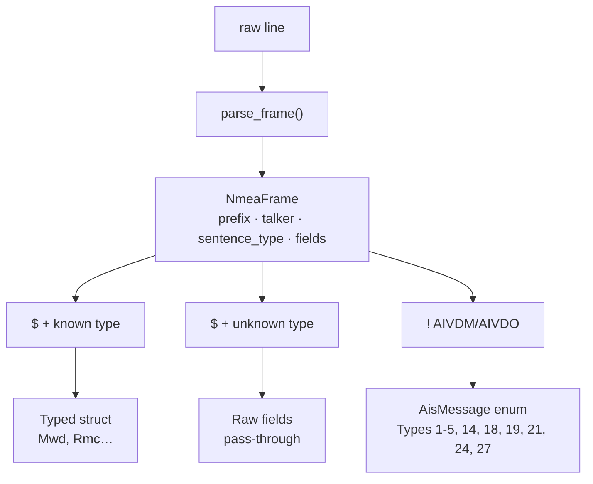

# nmea-kit

Bidirectional NMEA 0183 parser/encoder with AIS message decoding, written in Rust.

| | |
|---|---|
| **Crate** | `nmea-kit` |
| **Version** | 0.5.0 |
| **MSRV** | 1.85.0 |
| **Edition** | 2024 |
| **Dependencies** | 0 |
| **License** | MIT OR Apache-2.0 |
| **NMEA sentences** | 30 (bidirectional: parse + encode) |
| **AIS message types** | 16 (read-only decode) |

- **Shared frame layer** — handles `$` (NMEA) and `!` (AIS) framing, IEC 61162-450 tag blocks
- **No `nom`, no proc-macro** — `FieldReader`/`FieldWriter` helpers for clean sequential parsing

## Quick start

### Parse an NMEA sentence

```rust
use nmea_kit::{parse_frame, NmeaSentence};

let frame = parse_frame("$IIMWD,046.,T,046.,M,10.1,N,05.2,M*43").unwrap();
let sentence = NmeaSentence::parse(&frame);

match sentence {
    NmeaSentence::Mwd(mwd) => {
        println!("True wind dir: {:?}°", mwd.wind_dir_true);
        println!("Wind speed: {:?} kts", mwd.wind_speed_kts);
    }
    _ => {}
}
```

### Encode and send an NMEA sentence

```rust
use nmea_kit::nmea::NmeaEncodable;
use nmea_kit::nmea::sentences::Dbt;

let dbt = Dbt {
    depth_feet: Some(7.7),
    depth_meters: Some(2.3),
    depth_fathoms: Some(1.3),
};

let sentence = dbt.to_sentence("SD");
// "$SDDBT,7.7,f,2.3,M,1.3,F*05\r\n"
```

### Decode AIS messages

```rust
use nmea_kit::parse_frame;
use nmea_kit::ais::{AisParser, AisMessage};

let mut parser = AisParser::new();
let frame = parse_frame("!AIVDM,1,1,,A,13aEOK?P00PD2wVMdLDRhgvL289?,0*26").unwrap();

if let Some(AisMessage::Position(pos)) = parser.decode(&frame) {
    println!("MMSI: {}, lat: {:?}, lon: {:?}", pos.mmsi, pos.latitude, pos.longitude);
}
```

## Architecture



**Frame layer** validates checksum, strips tag blocks, extracts talker ID and sentence type. Shared by both NMEA and AIS.

**NMEA content** uses `FieldReader`/`FieldWriter` for sequential field parsing and encoding. Each sentence type is a standalone struct with `parse()`, `encode()`, and `to_sentence()`. Parsing is lenient: `parse()` always returns `Some` for known types, mapping missing or malformed fields to `None`. This is intentional for marine instruments that often produce partial data.

**AIS content** decodes 6-bit ASCII armor into a bitstream, handles multi-fragment reassembly, and extracts typed fields. Read-only (transmitting AIS requires certified hardware).

## Supported types

### NMEA 0183 sentences (bidirectional) — [full coverage list](SENTENCES.md)

| Category | Sentences |
|----------|-----------|
| Position | RMC, GGA, GLL, GNS |
| Satellites | GBS, GST |
| Wind | MWD, MWV |
| Heading | HDT, HDG, HDM, THS |
| Course & Speed | VBW, VLW, VTG, VHW |
| Depth | DPT, DBT, DBS, DBK |
| Steering | ROT, RSA |
| Environment | MTW, XDR¹ |
| Waypoints & Routes | RMB |
| Communication | TXT |
| Time | ZDA |
| Proprietary | PASHR, PGRME, PSKPDPT |

¹ `Xdr` has an additional `to_sentences() -> Vec<String>` method that automatically splits many measurements into multiple sentences to stay within the 82-character NMEA line limit.

### AIS messages (read-only) — [full type list](SENTENCES.md#ais-message-types-decoded-from-aivdmaivdo)

| Type(s) | Struct | Description |
|---------|--------|-------------|
| 1, 2, 3 | `PositionReport` | Class A position report |
| 4 | `BaseStationReport` | Base station UTC + position |
| 5 | `StaticVoyageData` | Static and voyage data (Class A) |
| 6 | `BinaryAddressed` | Addressed binary message (DAC/FID + data) |
| 7, 13 | `BinaryAck` | Binary / safety acknowledge |
| 8 | `BinaryBroadcast` | Binary broadcast message (DAC/FID + data) |
| 9 | `SarAircraftReport` | Standard SAR aircraft position |
| 11 | `UtcDateResponse` | UTC/date response (mobile station) |
| 12 | `SafetyAddressed` | Addressed safety-related message |
| 14 | `SafetyBroadcast` | Safety-related broadcast message |
| 15 | `Interrogation` | Interrogation (request data from vessel) |
| 18 | `PositionReport` | Class B standard position |
| 19 | `PositionReport` | Class B+ extended position |
| 21 | `AidToNavigation` | Aid-to-navigation report (buoys, beacons) |
| 24 | `StaticDataReport` | Static data report (Class B) |
| 27 | `LongRangePosition` | Long range position (satellite AIS, 1/10° precision) |

### Key improvements over existing crates

| Issue | `nmea` 0.7 / `ais` 0.12 | `nmea-kit` |
|-------|--------------------------|------------|
| NMEA sentence coverage | ~10 types, rest manual | 30 types, all typed |
| AIS message coverage | ~5 types | 16 types (1-9, 11-15, 18-19, 21, 24, 27) |
| Encoding | Read-only | Bidirectional (parse + encode) |
| Error distinction | Can't tell unsupported vs malformed | Frame errors vs content errors |
| AIS lat/lon precision | `f32` (11m error) | `f64` |
| AIS sentinels | 91/181/511 leak to caller | Filtered to `None` at decode |
| Tag blocks | Manual stripping | Built into frame layer |
| Dependencies | `nom` (AIS) | Zero |

## Features

```toml
[dependencies]
nmea-kit = "0.5"
```

| Feature | Default | Enables |
|---------|---------|---------|
| `nmea` | yes | All 30 NMEA sentence types |
| `ais` | yes | AIS message decoding |
| `positioning` | via `nmea` | GGA, GLL, RMC, GNS |
| `speed` | via `nmea` | VTG, VHW, VBW, RMC |
| `heading` | via `nmea` | HDG, HDM, HDT, THS |
| `wind` | via `nmea` | MWD, MWV |
| `depth` | via `nmea` | DBT, DBS, DBK, DPT |
| `dbk`, `dbs`, `dbt`, `dpt`, `gbs`, `gga`, `gll`, `gns`, `gst`, `hdg`, `hdm`, `hdt`, `mtw`, `mwd`, `mwv`, `pashr`, `pgrme`, `pskpdpt`, `rmb`, `rmc`, `rot`, `rsa`, `ths`, `txt`, `vbw`, `vhw`, `vlw`, `vtg`, `xdr`, `zda` | via `nmea` | Individual sentence types |

Use a group feature for common use cases:

```toml
# Only positioning sentences (GGA, GLL, RMC, GNS), no AIS
nmea-kit = { version = "0.3", default-features = false, features = ["positioning"] }
```

Cherry-pick individual sentences you need:

```toml
nmea-kit = { version = "0.3", default-features = false, features = ["rmc", "mwd"] }
```

NMEA-only (no AIS, all sentences):

```toml
nmea-kit = { version = "0.3", default-features = false, features = ["nmea"] }
```

## Coordinate conversion

NMEA sentences encode lat/lon as `DDMM.MMMM`; AIS uses decimal degrees. Two helpers bridge the gap:

```rust
use nmea_kit::nmea::{ddmm_to_decimal, decimal_to_ddmm};

// Parse a GGA latitude field: "4807.038" N → 48.1173°
let lat = ddmm_to_decimal(4807.038); // → 48.1173

// Encode back for a sentence
let ddmm = decimal_to_ddmm(48.1173); // → 4807.038
```

Apply the N/S / E/W sign separately (negate for S or W).

## Documentation

| File | Purpose |
|------|---------|
| [CONTRIBUTING.md](CONTRIBUTING.md) | Getting started, TDD workflow, test rules, adding a sentence type |
| [SENTENCES.md](SENTENCES.md) | Full NMEA / AIS coverage matrix |
| [CHANGELOG.md](CHANGELOG.md) | Release history |
| [AGENTS.md](AGENTS.md) | API surface, struct fields, and patterns (optimized for LLMs) |

## License

MIT OR Apache-2.0
